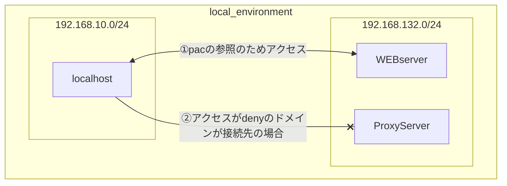

めちゃくちゃ雑に言うと、プロキシサーバの実装とjavaScriptでのルーティングやってみた。 検証環境のリソース確保のため、作業完了後にコンフィグはGitに保管して削除する。

### 目的

<aside> 🗣

- proxyに用いるソフトウェアの選定を行っている。 </aside>

※squidの必要ディスク容量：14.9MB

### 検証概要

- 候補の内、squidの動作確認を行った。

<aside> 💡 要点

- プロキシサーバを構築して、意図したWEBドメインにだけアクセスできないなら成功。
- 今回は*.yahoo.co.jpのドメインのWEBサイトが閲覧できないように設定した。
- WEBサーバ（apache）に配置したpacファイルが宛先のドメインを見て、プロキシサーバ or IntenetへのDirectかでルーティングする。
- プロキシサーバ（squid）のACLでyahoo宛ての通信を破棄する。 </aside>



### 検証詳細

Proxyサーバによって、LAN内にあるクライアント端末のWEBアクセス制御が行えるか確認を行った。 制御の対象はクライアントからHTTPによる特定のWEBドメイン宛て通信であり、結果の確認方法はブラウザからのWEB閲覧可否とする。 （今回はyahooニュースのサイトなど、”*.yahoo.co.jp”ドメインにアクセスした時ブロックが入るように設定を行った）

なお、Proxyサーバ（squid）に書き込んだACLに、アクセスさせたく無いWEBドメインを記載しているが、 クライアントがACLを参照できるようにルーティングする必要がある。 サーバをネクストホップに設定する事はできないため、以下の方法を取った。 新たにWEBサーバ（apache）を構築しpacファイルを配置。pacにjavaScriptでルーティングを記載し、クライアントはhttp通信でapacheのWEBサーバへ都度アクセスする事とする。 pacファイルに記載されたルールに従って、ダイレクトにInternetへアクセスするか、Proxyサーバを経由するかの選択を行う。

また、Proxyサーバ・WEBサーバのデプロイは仮想アプライアンス（VMware Workstation Player)にて行っており、ホストサーバであるWindows10をクライアント端末として扱った。 検証の大まかな順序は以下である。

1. クライアントがインターネットへアクセス可能であり、この後制御する予定のWEBサイトへアクセス可能な事を確認する。
2. Proxyサーバを有効化し、クライアントから意図したドメインへアクセスできない事を確認する。
3. Proxyサーバを無効化し、1の状態に復元できた事を確認する。

---

> FAQ
> 
> - クライアントは同じ条件で2台VMをデプロイし、Proxyの設定差異によってアクセス制御の可否を示さないといけないのではないか？ ローカルPCでの検証だと、アクセスが制御できてもローカルPC依存である可能性を含まないか。
>     
>     ホストPCのリソース状況を鑑みて、クライアント用VMを増やす事が出来なかった。 そもそも、squidのActive/inActiveを切り替えて制御状況を確認すれば、クライアント依存の問題を含む可能性は低いと考えている。
>     
> - WEBserver（apache）では無く、クライアントのlocalhostにpacを設定すればいいのではないか？
>     
>     localhostに配置する方法も問題ないはず。ただ、実務を想定した時クライアントが1つの環境はほぼ無い。 複数の各ホストにファイルを配置すると、パラメータ1つが変更になっただけで、修正に多大な労力がかかる。 都度WEBserverに問い合わせる運用がコストは低いと考えた。
>     

### 検証環境

ProxyサーバおよびWEBサーバは仮想アプライアンス（VMware Workstation Player)にてデプロイする。

- ホストOS：Windows10 ( VMware Workstation Player )のインストール先
    
- ゲストOS：Ubuntu ※今回はVMを2つ用意したが、全てUbuntuを用いた（RHELの方が軽いけど、ライセンス開放忘れが多くて上限来ちゃった）
    
    ||role|hostname|ip|subnet|OS|
    |---|---|---|---|---|---|
    |1|WEBserver|webSvr|192.168.132.3|/24|Ubuntu|
    |2|Proxyserver|prxSvr|192.168.132.128|/24|Ubuntu|
    |3|Client|localhost|192.168.10.10(DHCP)|/24|Windows10|
    |||||||
    |||||||
    |||||||
    |||||||
    

### 手順

- 操作対象ホスト:prxSvr

---

1. squidのインストール実施
    
    ```
    $ sudo apt update
    $ sudo apt install squid
    ```
    
2. /etc/squid/squid.conf が存在する事を確認する。
    
    ```
    $ cd /etc/squid/
    $ ls
    ```
    
3. squid.confに以下のconfigを投入する。
    
    ```
    # Define the local network
    acl localnet src 192.168.10.0/24
    
    # Define the domain to block
    acl blocked_domain dstdomain .yahoo.co.jp
    http_access deny blocked_domain
    
    # Allow access from the local network to all other sites
    http_access allow localnet
    
    # Deny all other access
    http_access deny all
    ```
    
    ---
    
    > 備考 VScodeのターミナル表示可能行数がデフォルトだと1000行。 squid.confの行数がこれをはるかに超えるため、以下を参照し、行数を増やしてから確認を行った。
    
    [【VSCode】最低限の設定（settings.json, 拡張機能）](https://blog.aiandrox.com/posts/tech/2021/04/09/)
    
4. squidの自動起動を有効化し、再起動をかける。
    
    ```
    $ sudo systemctl enable squid
    
    ※以下表示が出てきたら成功
    Synchronizing state of squid.service with SysV service script with /lib/systemd/systemd-sysv-install.
    Executing: /lib/systemd/systemd-sysv-install enable squid
    $ sudo systemctl restart squid
    ```
    
5. squidが許可しているポートの確認。
    
    ```
    $ sudo ss -tuln | grep LISTEN
    $ sudo lsof | grep LISTEN
    squid     ****                       proxy   12u     IPv6              32237       0t0        TCP *:3128 (LISTEN)
    ```
    

- 操作対象ホスト:webSvr

---

1. apache2をインストール
    
    ```
    $ sudo apt update
    $ sudo apt install apache2
    ```
    
    ---
    
    > 備考 apach2.4が自動でインストールされるはずだけど、2.2も一応存在していて、そっちはサポート切れている？みたいな情報を見た。インストール後一応都度確認した方が良いかも。
    
2. apache2の起動と、自動起動の有効化
    
    ```
    $ sudo systemctl start apache2
    $ sudo systemctl enable apache2
    
    ※以下表示が出てきたら成功
    Synchronizing state of apache2.service with SysV service script with /lib/systemd/systemd-sysv-install.
    Executing: /lib/systemd/systemd-sysv-install enable apache2
    ```
    
3. apache2のDocumentRootにPACファイルを作成。pacファイルを書き込むためにviエディタを起動。
    
    ```
    $ cd ./var/www/html/
    $ sudo touch proxy.pac
    $ cat ./proxy.pac/
    $ vi ./proxy.pac/
    ```
    
4. pacファイルを配置する。
    
    ```jsx
    function FindProxyForURL(url, host) {
    	if (shExpMatch(host, "*.yahoo.co.jp")) {
    		return "PROXY 192.168.132.128:3128";
    	}
    	return "Direct";
    }
    ```
    
    ---
    
    > 備考 個人的にはこのサイトの説明が分かりやすい。
    > 
    > [FindProxyForURL() 関数 (Sun Java System Web Proxy Server 4.0.4 管理ガイド)](https://docs.oracle.com/cd/E19528-01/820-0863/adyrr/index.html)
    > 
    > [shExpMatch()(str, shexp) (Sun Java System Web Proxy Server 4.0.4 管理ガイド)](https://docs.oracle.com/cd/E19528-01/820-0863/adyse/index.html)
    
5. apache2のコンフィグファイルに設定を投入する。
    
    ```
    $ cd /
    $ cd /etc/apache2/sites-available/
    $ vi ./000-default.conf/
    ```
    
    ```
    <VirtualHost *:80>
        ServerAdmin webmaster@localhost
        DocumentRoot /var/www/html
    
    -------------------------------------------------↑ここまではデフォルトで入っている。
    
        # Add this block to serve the PAC file
        <Location /proxy.pac>
            SetHandler none
        </Location>
        
    -------------------------------------------------↓ここ以降も編集しなくて良い。
    </VirtualHost>
    
    ```
    
6. webSvrのfirewall設定を確認し、再起動をかける。
    
    ```
    $ sudo ufw status
    　※Port80が解放されている事を確認する。
    $ sudo ufw enable
    $ sudo systemctl restart ufw
    ```
    

- 操作対象ホスト：localhost

---

1. ブラウザからyahoo.co.jpのWEB閲覧ができることを確認する。 ※確認したらキャッシュは削除してブラウザは一度再起動する。
    
2. Windowsの手動プロキシ設定を実施する。
    
    ```
    Windows +R キーで"ファイル名を指定して実行"のダイアログが表示。
    inetcpl.cplと入力しOK
    
    表示された画面にて、接続タブ > （画面右下の)LANの設定 をクリック
    ・設定を自動的に検出
    ・自動構成スクリプトを使用
    上記2つにチェックを入れて、アドレス欄にapacheサーバのアドレスとポートを入力
    
    addresp : <http://192.168.132.3/proxy.pac/>
    port : 80
    
    ```
    
3. ブラウザからyahoo.co.jpで検索し、ページが表示されない事と、その他WEBサイトは表示できる事を確認する。 ※Chromeの場合、仕様上tempファイル以外にも情報が残るため、設定画面から履歴・キャッシュ・Cookie全て消しても、 　記録が残ったまま > アクセスができてしまう場合がある。 　他ブラウザを使用するか、Chromeのシークレットモードなら問題なく想定通りの動作がみられる。
    

以上
